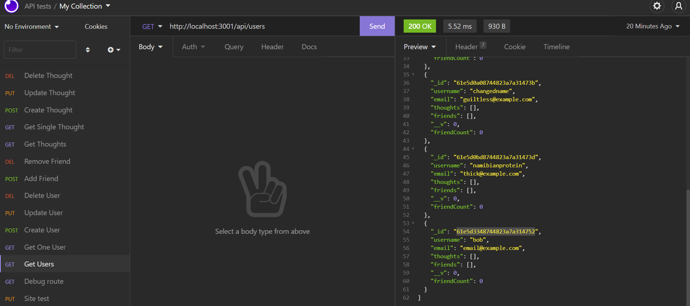

# Social Media Backend 

## Description
This is an assignment where the backend of a social media site was built. It uses Mongodb, Mongoose, NodeJS, and ExpressJS. [The video demonstration can be viewed here.](https://drive.google.com/file/d/1w0sXd_5CWbDUJRZKrdi6nZ4x4r1XL_0F/view?usp=sharing)

## Table of Contents
* [Installation](#installation)
* [Usage](#usage)
* [License](#license)
* [Contribution](#contribution)
* [Tests](#tests)
* [Questions](#questions)

## Installation 
This application can be installed by cloning this repository. After that, you will open the root folder and run `npm i`. 

## Usage 
This application can be used in an api testing tool like insomnia. You will want to send the proper requests as demonstrated in the video.

## License 
Copyright zachary-berdell-elliott

Permission is hereby granted, free of charge, to any person obtaining a copy of this software and associated documentation files (the “Software”), to deal in the Software without restriction, including without limitation the rights to use, copy, modify, merge, publish, distribute, sublicense, and/or sell copies of the Software, and to permit persons to whom the Software is furnished to do so, subject to the following conditions:

  The above copyright notice and this permission notice shall be included in all copies or substantial portions of the Software.
    
  THE SOFTWARE IS PROVIDED “AS IS”, WITHOUT WARRANTY OF ANY KIND, EXPRESS OR IMPLIED, INCLUDING BUT NOT LIMITED TO THE WARRANTIES OF MERCHANTABILITY, FITNESS FOR A PARTICULAR PURPOSE AND NONINFRINGEMENT. IN NO EVENT SHALL THE AUTHORS OR COPYRIGHT HOLDERS BE LIABLE FOR ANY CLAIM, DAMAGES OR OTHER LIABILITY, WHETHER IN AN ACTION OF CONTRACT, TORT OR OTHERWISE, ARISING FROM, OUT OF OR IN CONNECTION WITH THE SOFTWARE OR THE USE OR OTHER DEALINGS IN THE SOFTWARE.

## Contribution 
This application can be contributed to by reaching out to me over email. You can report any bugs directly to me or ask for contribution permissions.

## Tests 
This application can be tested by installing it then trying out the diiferent api routes.

## Questions 
FAQ: 

There are currently no Frequently Asked Questions.

If you have any additional questions, please contact me at zacharyberdell@gmail.com to receive an answer to your question. If you would like to view other projects by me then [visit my profile here.](https://github.com/zachary-berdell-elliott)
